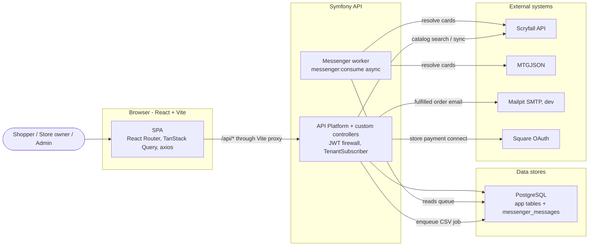

# Architecture

End-to-end maps of the MTG Store platform, from the React page a user clicks, through the HTTP route, backend entry point, services, repositories, and database rows.

Each feature doc pairs flow diagrams with a "where to go" table listing the exact classes/files at each layer.

## How to read these docs

Every request generally flows through these layers:

| Layer | What lives here | Backend location |
|-------|-----------------|------------------|
| Frontend | React page -> hook -> axios call | `frontend/src/` |
| HTTP route | Method + path | Symfony controller `#[Route]` or API Platform `uriTemplate` |
| Backend entry | Controller action or API Platform provider/processor | `src/Controller/`, `src/State/` |
| Service | Business logic, external APIs | `src/Service/` |
| Repository -> DB | Doctrine queries and row mutations | `src/Repository/`, PostgreSQL |

Two backend styles coexist:

- Custom controllers in `src/Controller/*` for auth, store settings, payment connections, customer account features, CSV import, and customer notifications.
- API Platform resources for entities such as `Store`, `InventoryItem`, and `Order`, with state providers/processors in `src/State/`.

## Feature index

| Domain | What it covers | Doc |
|--------|----------------|-----|
| **Data model** | Tables, columns, foreign keys, ER diagram, and the multi-tenancy pattern | [data-model.md](data-model.md) |
| **Auth & tenancy** | Login, register, `/me`, JWT mechanics, role-based access, and tenant SQL filtering | [auth-and-tenancy.md](auth-and-tenancy.md) |
| **Stores & branding** | Public store directory, storefront by slug, branding/theme editor, store payment connections, platform admin | [stores-and-branding.md](stores-and-branding.md) |
| **Catalog & inventory** | Card catalog search, inventory browse, inventory CRUD, Scryfall bulk sync, card details, spotlight | [catalog-and-inventory.md](catalog-and-inventory.md) |
| **CSV import** | Async bulk import lifecycle, failed-row recovery, card resolution, inventory writes, and live polling | [csv-import.md](csv-import.md) |
| **Customers & orders** | Per-store customer profiles, favorites, want lists, cart, test checkout, order workflow, notifications, and reports | [customers-and-orders.md](customers-and-orders.md) |

## System context

## Recurring patterns worth knowing

- **Multi-tenancy** - `TenantSubscriber` reads `{slug}` from `/api/stores/{slug}/*`, resolves the `Store`, and enables a Doctrine SQL filter that scopes `InventoryItem` and `Order` queries by `store_id`. `/api/admin/*` routes disable the filter so super-admins see everything.
- **Create-on-write** - customer profile, favorites, and want-list reads never create rows. The `StoreCustomer` row is created lazily on the first write.
- **Card resolution cascade** - local DB -> Scryfall -> MTGJSON, used by catalog search, CSV import, and failed-row recovery.
- **Batched async import** - the CSV worker claims rows with `SELECT ... FOR UPDATE SKIP LOCKED`, processes 25 at a time, and self-dispatches the next batch.
- **Persisted notifications** - customer notifications are stored in `customer_notifications`; Mailpit email is a delivery side effect. The frontend currently polls every 15 seconds.
- **Provider-owned payments** - payment provider credentials belong to the store connection in `store_payment_accounts`; the API never returns provider tokens.

## Local development dependencies

- PostgreSQL stores application data and the Messenger queue table.
- Mailpit receives local fulfillment emails on SMTP port `1025`; its UI runs on `http://localhost:8025`.
- Square OAuth is optional locally. When Square env vars are missing, the payments UI reports that Square is not configured, and local test orders still work because they bypass payment capture.
