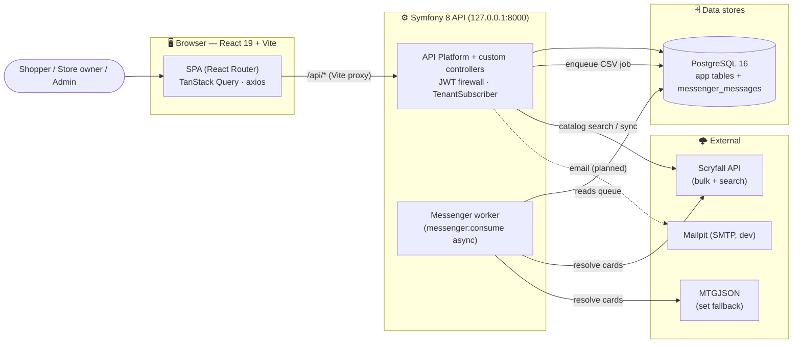

# Architecture

End-to-end maps of every feature in the MTG Store platform — from the React page a user clicks, through the HTTP route, backend entry point, services, repositories, and finally the database rows that change.

Each diagram is rendered with [Mermaid](https://mermaid.js.org/) (GitHub renders these natively). Every feature doc pairs a **flow diagram** with a **"where to go" table** listing the exact classes/files at each layer, so you can jump straight to the code.

## How to read these docs

Every request flows through the same five layers. Diagrams are labelled by layer:

| Layer | What lives here | Backend location |
|-------|-----------------|------------------|
| 🖥️ **Frontend** | React page → hook (TanStack Query) → axios call | `frontend/src/` |
| 🌐 **HTTP route** | Method + path | Symfony controller `#[Route]` or API Platform `uriTemplate` |
| 🎛️ **Backend entry** | Controller action **or** API Platform State Provider (reads) / Processor (writes) | `src/Controller/`, `src/State/` |
| ⚙️ **Service** | Business logic, external APIs | `src/Service/` |
| 🗄️ **Repository → DB** | Doctrine queries + row mutations | `src/Repository/`, PostgreSQL |

**Two backend styles coexist:**
- **Custom controllers** (`src/Controller/*`) — used for auth, store settings, customer accounts, and CSV import.
- **API Platform resources** — entities (`Store`, `InventoryItem`, `Order`) declare `#[ApiResource]` operations that delegate to **State Providers** (GET) and **State Processors** (POST/PATCH/DELETE) in `src/State/`.

## Feature index

| Domain | What it covers | Doc |
|--------|----------------|-----|
| **Data model** | All tables, columns, foreign keys, the ER diagram, and the multi-tenancy pattern | [data-model.md](data-model.md) |
| **Auth & tenancy** | Login, register, `/me`, JWT mechanics, role-based access (voters), the tenant SQL filter | [auth-and-tenancy.md](auth-and-tenancy.md) |
| **Stores & branding** | Public store directory, storefront by slug, branding/theme editor, platform admin (stores & users) | [stores-and-branding.md](stores-and-branding.md) |
| **Catalog & inventory** | Card catalog search, inventory browse, inventory CRUD, Scryfall bulk sync, card details, spotlight | [catalog-and-inventory.md](catalog-and-inventory.md) |
| **CSV import** | Async bulk import lifecycle, failed-row recovery, card resolution, inventory writes, and live polling | [csv-import.md](csv-import.md) |
| **Customers & orders** | Per-store customer profiles, favorites, want lists, orders, and sales reports | [customers-and-orders.md](customers-and-orders.md) |

## System context

## Recurring patterns worth knowing

- **Multi-tenancy** — `TenantSubscriber` reads `{slug}` from `/api/stores/{slug}/*`, resolves the `Store`, and enables a Doctrine SQL filter (`TenantFilter`) that auto-scopes `InventoryItem` and `Order` queries by `store_id`. `/api/admin/*` routes disable the filter so super-admins see everything. See [auth-and-tenancy.md](auth-and-tenancy.md#multi-tenancy-filter).
- **Create-on-write** — customer profile / favorites / want-list `GET`s never mutate (return empty if no row); the `StoreCustomer` row is created lazily on first `PUT`/`POST`/`PATCH`. See [customers-and-orders.md](customers-and-orders.md).
- **Card resolution cascade** — local DB -> Scryfall -> MTGJSON, used by catalog search, CSV import, and failed-row recovery. See [catalog-and-inventory.md](catalog-and-inventory.md#card-resolution-cascade).
- **Batched async import** — the CSV worker claims rows with `SELECT … FOR UPDATE SKIP LOCKED`, processes 25 at a time, and self-dispatches the next batch. See [csv-import.md](csv-import.md).
