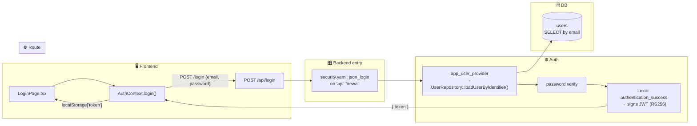
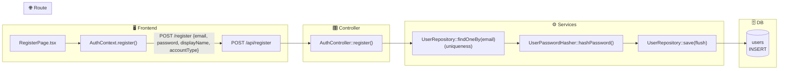
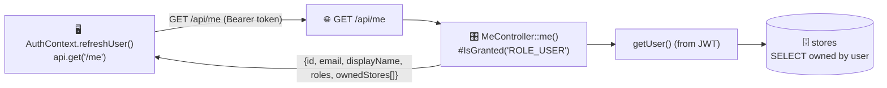
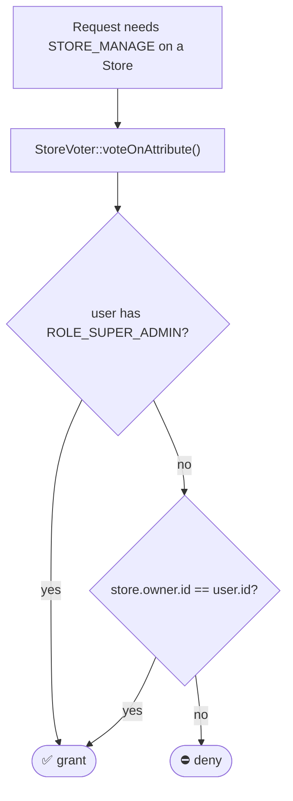
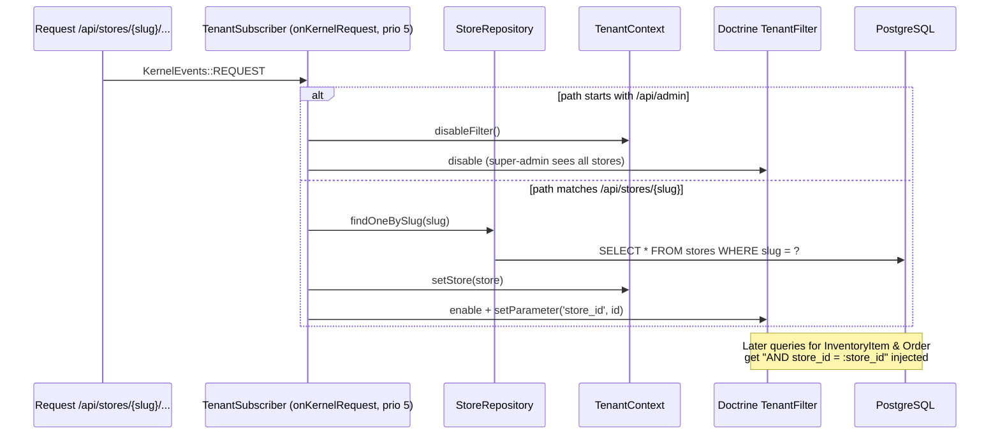

# Auth & tenancy

Covers login, registration, the current-user endpoint, JWT mechanics, role-based access control, and the multi-tenant SQL filter that scopes store data.

- **Firewalls & rules:** `backend/config/packages/security.yaml`
- **JWT config:** `backend/config/packages/lexik_jwt_authentication.yaml`
- **Routes:** `backend/config/routes/auth.yaml`, `security.yaml`

Access-control rules (from `security.yaml`):

| Path | Requirement |
|------|-------------|
| `^/api/login`, `^/api/register` | `PUBLIC_ACCESS` |
| `^/api/admin` | `ROLE_SUPER_ADMIN` |
| `^/api` (everything else) | `IS_AUTHENTICATED_FULLY` |

---

## Login

- Token is stored in `localStorage` and attached as `Authorization: Bearer <token>` by an axios request interceptor in `frontend/src/api/client.ts`. A response interceptor clears the token and redirects to `/login` on `401`.
- The `api` firewall is **stateless** (no session); every request re-validates the JWT and reloads the user via `loadUserByIdentifier`.
- **Brute-force protection:** the `login` firewall enables `login_throttling` (max 5 failed attempts per IP+username per 15 min, backed by `symfony/rate-limiter`). Because Lexik's failure handler renders every failure as `401`, `App\Security\AuthenticationFailureHandler` decorates it to return **`429 Too Many Requests`** (with `Retry-After`) for the throttle case and delegate all other failures to Lexik unchanged.
- **Request correlation:** `App\EventSubscriber\RequestIdSubscriber` assigns each request a correlation id (honoring an inbound `X-Request-Id`), echoes it on the response header, and logs unhandled exceptions with structured context (`request_id`, method, path, status) for traceability.

| Layer | Where |
|-------|-------|
| Frontend | `pages/LoginPage.tsx`, `context/AuthContext.tsx`, `api/client.ts` |
| Route | `POST /api/login` |
| Entry | `json_login` handler (config, no controller) |
| Service | `UserRepository::loadUserByIdentifier`, Lexik `authentication_success` |
| DB | `users` (read) |

---

## Register

- `accountType: 'owner'` grants `ROLE_STORE_OWNER`; `'customer'` gets `ROLE_USER`. **Admins cannot self-register** — use `php bin/console app:create-admin`.
- Validation: email format, password ≥ 8 chars, display name required.

| Layer | Where |
|-------|-------|
| Frontend | `pages/RegisterPage.tsx`, `context/AuthContext.tsx` |
| Route | `POST /api/register` |
| Entry | `Controller/AuthController::register()` |
| Service | `UserRepository`, `UserPasswordHasherInterface` |
| DB | `users` (read for uniqueness, insert) |

---

## Current user — `/api/me`

Returns the authenticated user plus their owned stores (drives the "manage store" UI). No writes.

| Layer | Where |
|-------|-------|
| Frontend | `context/AuthContext.tsx` (`refreshUser`) |
| Route | `GET /api/me` |
| Entry | `Controller/MeController::me()` (`#[IsGranted('ROLE_USER')]`) |
| DB | `users` + `stores` (read) |

---

## Roles & authorization (the `StoreVoter`)

**Roles:** `ROLE_USER` (all authenticated) → `ROLE_STORE_OWNER` (owns store[s]) → `ROLE_SUPER_ADMIN` (platform admin, created only via CLI).

The `STORE_MANAGE` attribute is checked by:
- **Custom controllers** via `denyAccessUnlessGranted('STORE_MANAGE', $store)` (e.g. `StoreSettingsController`, `StoreCsvImportController`).
- **API Platform** via `security: "is_granted('STORE_MANAGE', ...)"` on write operations of `InventoryItem` and `Order`.

The frontend mirrors this with `useCanManageStore(slug)` and `<ProtectedRoute requireSuperAdmin / requireStoreOwner>`.

| Layer | Where |
|-------|-------|
| Backend voter | `Security/StoreVoter.php` (attribute `STORE_MANAGE`) |
| Frontend | `hooks/useCanManageStore.ts`, `components/ProtectedRoute.tsx`, `context/AuthContext.tsx` |

---

## Multi-tenancy filter

Every `/api/stores/{slug}/*` request is intercepted **before** the controller/provider runs, so store-scoped queries are automatically constrained to that tenant.

- **`TenantContext`** (`src/MultiTenancy/TenantContext.php`) — in-memory holder for the current `Store` + enabled flag.
- **`TenantFilter`** (`src/MultiTenancy/TenantFilter.php`) — a Doctrine `SQLFilter` that appends `store_id = :store_id` to `InventoryItem` and `Order` queries.
- **`TenantSubscriber`** (`src/EventSubscriber/TenantSubscriber.php`) — wires the two together per request.

This is why the inventory/order State Providers can simply call `repository->findByStore(tenantContext->getStore())` and trust isolation.

| Layer | Where |
|-------|-------|
| Subscriber | `EventSubscriber/TenantSubscriber.php` |
| Context | `MultiTenancy/TenantContext.php` |
| SQL filter | `MultiTenancy/TenantFilter.php` |
| DB | `stores` (read for resolution); filter applied to `inventory_items`, `orders` |
