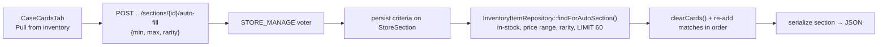

# Case cards

Covers the owner-curated "Case Cards" sections shown on a store's public Case Cards page. A store owner creates named sections and fills each one either **manually** (search inventory, hand-pick listings) or **automatically** (set a price range + rarity, then click "Pull from inventory"). Both paths materialise a concrete, ordered list of inventory listings, so rendering the public page is a plain read.

This is a separate area from the price-threshold **Spotlight** rail (see [stores-and-branding](./stores-and-branding.md)); the two coexist.

## Data model

Two tables, both cascading off their parents so cleanup is automatic (see [data-model](./data-model.md)).

| Entity | Table | Notes |
|--------|-------|-------|
| `StoreSection` | `store_sections` | A named, positioned group. `mode` is `manual` or `auto`; `auto_min_price_cents` / `auto_max_price_cents` / `auto_rarity` hold the last-used auto criteria. Indexed on `(store_id, position)`. |
| `StoreSectionCard` | `store_section_cards` | Join row: one `InventoryItem` placed in a section at a `position`. Unique on `(section_id, inventory_item_id)` so a listing can't appear twice in one section. |

Cascades:
- Deleting a `Store` removes its sections; deleting a section removes its `StoreSectionCard` rows (`onDelete: CASCADE` + `orphanRemoval`).
- Deleting an `InventoryItem` removes it from every section it was placed in (`onDelete: CASCADE` on `inventory_item_id`) — a card that leaves inventory silently drops out of the case.

The manual/auto distinction is only about *how the rows are produced*. Once produced, an auto section is just as editable as a manual one (you can remove individual cards), and re-running the pull replaces the contents.

## API

All routes live in `StoreSectionController`, scoped under `/api/stores/{slug}/sections`. Every mutating route is gated on the `STORE_MANAGE` voter (super-admin OR the store's owner — see [auth-and-tenancy](./auth-and-tenancy.md)). The list route is **public** because it backs the storefront page.

| Operation | Route | Access |
|-----------|-------|--------|
| List sections (with cards) | `GET /api/stores/{slug}/sections` | Public |
| Create section | `POST /api/stores/{slug}/sections` | `STORE_MANAGE` |
| Update section (title/mode/criteria) | `PATCH /api/stores/{slug}/sections/{id}` | `STORE_MANAGE` |
| Delete section | `DELETE /api/stores/{slug}/sections/{id}` | `STORE_MANAGE` |
| Add listings (manual) | `POST /api/stores/{slug}/sections/{id}/items` | `STORE_MANAGE` |
| Remove a listing | `DELETE /api/stores/{slug}/sections/{id}/items/{cardId}` | `STORE_MANAGE` |
| Pull from inventory (auto) | `POST /api/stores/{slug}/sections/{id}/auto-fill` | `STORE_MANAGE` |

Notes:
- **Add is idempotent and store-scoped.** `POST .../items` accepts `inventoryItemId` or `inventoryItemIds[]`; listings already in the section, or not belonging to this store, are skipped silently. New rows append after the existing ones.
- **Auto-fill is a one-shot materialisation.** The same request that clicks "Pull" may also carry `autoMinPriceCents` / `autoMaxPriceCents` / `autoRarity`, which are persisted onto the section before the pull. The section's cards are then cleared and replaced by up to `AUTO_FILL_MAX` (60) matching in-stock listings, highest price first (`InventoryItemRepository::findForAutoSection()`). Re-running with the same criteria yields the same set — no duplicates.
- `autoRarity` is validated against `common, uncommon, rare, mythic, special, bonus`.

## Auto-fill flow

## Frontend

- **Storefront button.** The "Case cards" quick-action tile on `StorePage` links to `/s/{slug}/case-cards`.
- **Storefront page.** `CaseCardsPage` reads `useStoreSections(slug)` and renders each non-empty section as a horizontal rail of `SpotlightCard` tiles (the same holographic tile used by the Spotlight rail). Empty sections are hidden here.
- **Admin tab.** `CaseCardsTab` (store admin → "Case cards") creates sections and manages each one: manual sections open an inventory picker modal (`useInventory`, client-side name filter) to add listings; auto sections expose min/max price + rarity inputs and the "Pull from inventory" button. Both show the current cards with per-card remove buttons.
- **Shared query.** `useStoreSections` (key `['store-sections', slug]`) is used by both the public page and the admin tab; every admin mutation invalidates it.

## Tests

`tests/Controller/StoreSectionControllerTest.php` covers: owner creates a section, manual add/remove (including idempotent re-add and the store-ownership boundary on added listings), auto-fill by price + rarity, auto-fill repeatability (replace, not duplicate), public anonymous read, and the authorization boundary (a non-owner gets 403, an anonymous create gets 401). The `/api` firewall is stateless JWT, so the test mints a Bearer token per user rather than relying on a session cookie.
