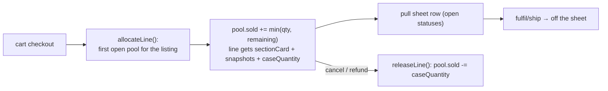

# Case cards

Covers the owner-curated display cases shown on a store's public Case Cards page and the fulfillment paperwork behind them. A store has any number of named **cases** (physical displays — "Front Counter Case", "Wall Case"), each divided into **sections** ("Black", "Azorius", "Rares $20+"). Every section is a self-contained, trackable inventory pool: it holds a fixed number of copies per card, depletes as customers buy, can never be oversold, and feeds a printable **pull sheet** so staff know exactly what to fetch from where.

This is a separate area from the price-threshold **Spotlight** rail (see [stores-and-branding](./stores-and-branding.md)); the two coexist.

## Data model

| Entity | Table | Notes |
|--------|-------|-------|
| `StoreCase` | `store_cases` | A named physical display case. Store-scoped, positioned, cascades away with the store. |
| `StoreSection` | `store_sections` | A labeled area inside a case (`case_id`, CASCADE). `mode` is `manual` or `auto`; auto criteria: `auto_min_price_cents`, `auto_max_price_cents`, `auto_rarity`, `auto_color_identity` (canonical code), `auto_set_code`, `auto_card_type`. Keeps a redundant `store_id` for scoping. |
| `StoreSectionCard` | `store_section_cards` | One `InventoryItem` in a section's pool: `quantity` (copies allocated to the case, default 1 = one display slot) and `sold_quantity`. `remaining = quantity - sold` is what the section can still sell. Unique on `(section_id, inventory_item_id)`. |
| `OrderLine` (additions) | `order_lines` | Case provenance: `section_card_id` (SET NULL — pool restore on cancel), `case_name` + `section_title` snapshots (survive dismantled cases on paperwork), `case_quantity` (copies of the line pulled from the case). |

Existing v1 sections were migrated into a default "Display Case" per store (`Version20260720032341`).

## Smart color-identity filters

`App\Service\CaseCards\ColorIdentityParser` maps natural terms to canonical codes so owners never type internal values:

- **Mono colors**: `Black`, `mono red`, single letters (`b`).
- **Guilds / shards / wedges**: `Azorius`→`WU`, `Esper`→`WUB`, `Abzan`→`WBG`, all 20.
- **Four-color**: `four-color`/`4c` (any four), C16 names (`Growth`), Nephilim names (`Yore-Tiller`), `sans white` / `no red`.
- **Five-color**: `five-color`, `5c`, `WUBRG`, `rainbow`.
- **Specials**: `Colorless`→`C`, `Multicolor`/`gold`→`M`.
- **Raw letter combos**: any WUBRG subset in any order (`gw`→`WG`).

Canonical codes are stored on the section; unknown terms 422 with examples. `label()` renders codes back for humans ("Azorius (WU)"). The admin UI offers a datalist of common names; the parser accepts far more.

## Auto-fill (`SectionAutoFiller`)

"Pull from inventory" materialises up to 60 listings matching every filter, one pool copy each:

- price/rarity/set/card-type filter in SQL (`InventoryItemRepository::findAutoSectionCandidates`, batched);
- color identity (a JSON column) filters in PHP over the batches;
- **cross-section accounting**: unsold copies claimed by the store's *other* sections (`StoreSectionCardRepository::remainingAllocatedByItem`) are subtracted from stock, so two sections never promise the same physical copy and refills only use remaining eligible inventory.

Re-pulls **merge** rather than replace: matching cards keep their pool counts, new matches are added, stale rows *with sales* are kept but frozen (`quantity = sold`) so pending pull sheets and history survive, stale rows without sales are removed.

## Purchase lifecycle (`SectionSaleAllocator`)

- Checkout links each line to its `InventoryItem` and claims from the **first open pool** in case/section display order; a line is attributed to at most one section. Copies beyond the pool are unlabeled back-stock — the pool caps at zero and **cannot be oversold**.
- Entering `CANCELLED`/`REFUNDED` (both terminal, so never double-released) returns `case_quantity` to the pool via `StoreOrderStatusProcessor`.

## Pull sheets

`GET /api/stores/{slug}/sections/{id}/pull-sheet` (STORE_MANAGE) lists the section's case cards on orders in open statuses (`pending`, `received`, `paid`): card, set/collector, quantity to pull, order reference/status, customer. Fulfilling, cancelling, or refunding an order drops its lines automatically. The admin UI shows the sheet in a modal (30s auto-refresh) with an iframe-based print view titled "Case / Section".

## Order print sheets

Order lines expose `caseName` / `sectionTitle` / `caseQuantity` (admin `order:read` groups + customer serializer). The order sheet print-out renders an unmissable black **CASE CARD — {case} / {section}** badge per case line, including "pull N of M from case" when a line is split between case stock and back-stock; the on-screen order details show the same badge.

## API

All mutations require `STORE_MANAGE`; public reads back the storefront.

| Operation | Route |
|-----------|-------|
| List cases (nested sections+cards, public) | `GET /api/stores/{slug}/cases` |
| Case CRUD | `POST /cases`, `PATCH /cases/{id}`, `DELETE /cases/{id}` |
| Color vocabulary (public) | `GET /cases/filter-suggestions` |
| List sections (flat, public) | `GET /api/stores/{slug}/sections` |
| Section CRUD (create requires `caseId`) | `POST /sections`, `PATCH /sections/{id}`, `DELETE /sections/{id}` |
| Manual add (idempotent, optional pool `quantity`) | `POST /sections/{id}/items` |
| Edit pool size (clamped ≥ sold) | `PATCH /sections/{id}/items/{cardId}` |
| Remove card | `DELETE /sections/{id}/items/{cardId}` |
| Auto-fill (saves criteria + pulls) | `POST /sections/{id}/auto-fill` |
| Pull sheet | `GET /sections/{id}/pull-sheet` |

## Frontend

- **Storefront** (`CaseCardsPage`, `/s/{slug}/case-cards`): cases as headings, sections as labeled rails of holographic tiles; sold-out pool cards, empty sections, and empty cases are hidden.
- **Admin** (`CaseCardsTab`): create/delete cases; per-case section creation; per-section filter row (color datalist, rarity, set, type, price range) with "Pull from inventory"; per-card pool editing ("In case" count, sold/remaining badges); pull-sheet modal with print.
- **Orders** (`OrderLineList`, `printOrderSheet`): case badges on screen and on the printed sheet.

## Tests

`ColorIdentityParserTest` (34 unit tests over the vocabulary/matching/labels); `StoreSectionControllerTest` (case CRUD, sections require a case, pool-tracked manual add/edit, auto-fill by color term / set+type, unknown-term 422, cross-section claim exclusion, public anonymous read, authorization boundary); `CasePurchaseFlowTest` (purchase depletes the pool and stamps the line, oversell prevention past the pool, pull sheet across place→fulfil, cancel restores the pool).
