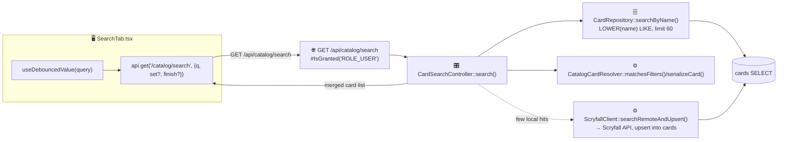
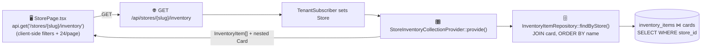
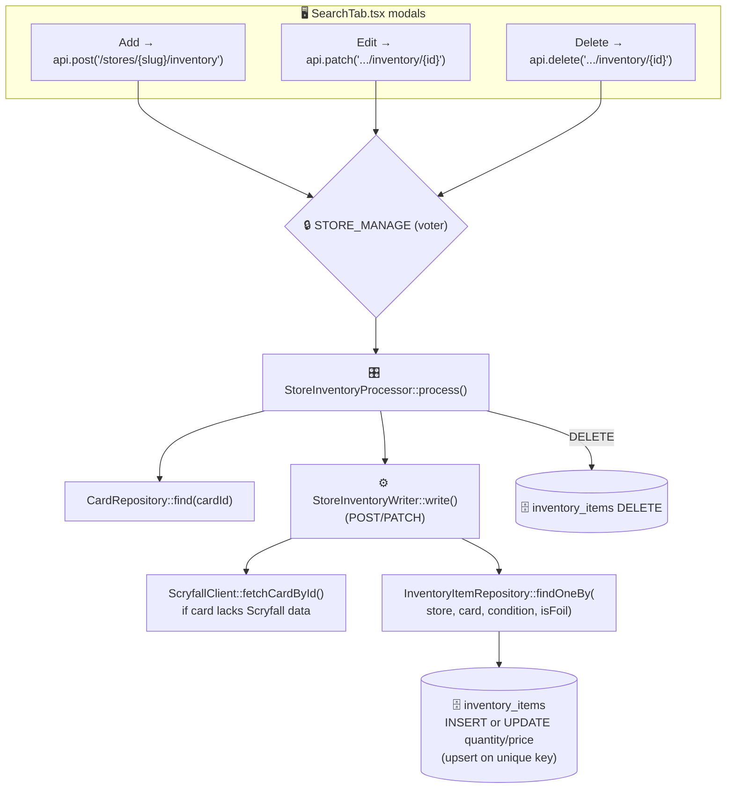
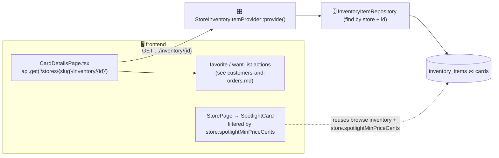
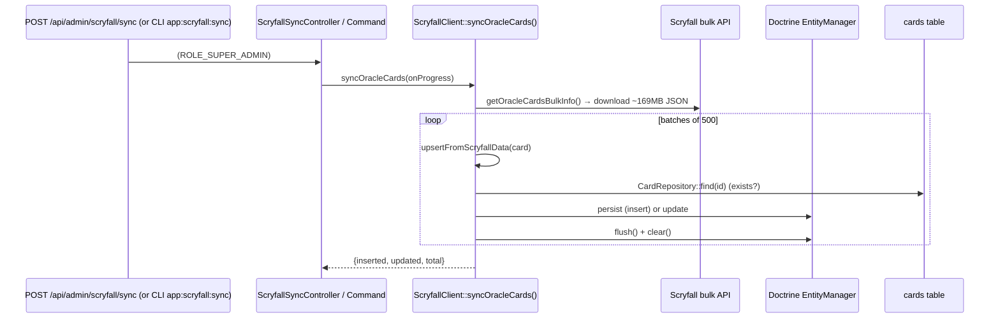
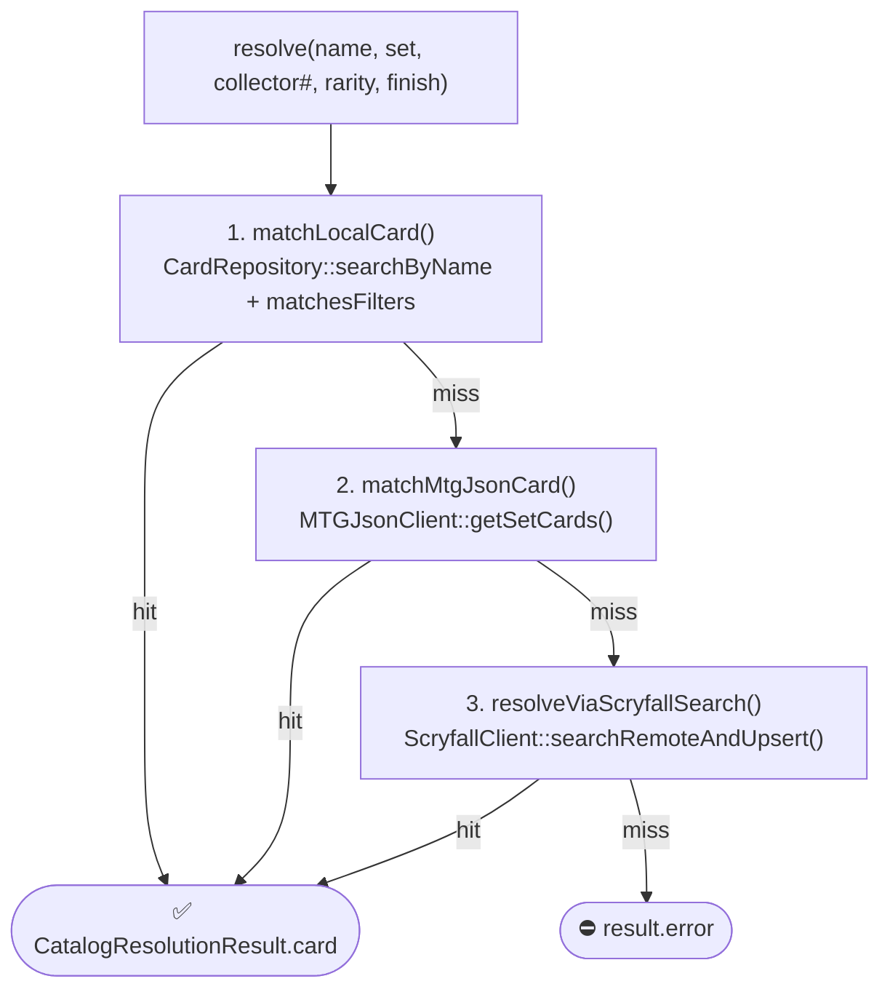

# Catalog & inventory

Covers card catalog search, browsing a store's inventory, inventory CRUD (owner), Scryfall bulk sync, the card details page, and the spotlight carousel.

- **`cards`** is a shared, global catalog (no `store_id`) synced from Scryfall.
- **`inventory_items`** is store-scoped (`store_id`) and unique per `(store, card, condition, is_foil)`.
- Inventory GET/POST/PATCH/DELETE are **API Platform operations** on `InventoryItem` delegating to State Providers/Processors; catalog search and Scryfall sync are **custom controllers**.

| Operation | Route | Backend |
|-----------|-------|---------|
| Catalog search | `GET /api/catalog/search` | `CardSearchController` |
| Browse inventory | `GET /api/stores/{slug}/inventory` | `StoreInventoryCollectionProvider` |
| Inventory item | `GET /api/stores/{slug}/inventory/{id}` | `StoreInventoryItemProvider` |
| Add inventory | `POST /api/stores/{slug}/inventory` | `StoreInventoryProcessor` |
| Edit inventory | `PATCH /api/stores/{slug}/inventory/{id}` | `StoreInventoryProcessor` |
| Delete inventory | `DELETE /api/stores/{slug}/inventory/{id}` | `StoreInventoryProcessor` |
| Scryfall sync | `POST /api/admin/scryfall/sync` | `ScryfallSyncController` |

---

## Catalog search

Searches the local catalog first; if results are thin it falls back to Scryfall live search and **upserts** the fetched cards into `cards` so subsequent searches are local.

| Layer | Where |
|-------|-------|
| Frontend | `pages/store-admin/SearchTab.tsx`, `hooks/useDebouncedValue.ts` |
| Route | `GET /api/catalog/search` (auth required) |
| Entry | `Controller/CardSearchController::search()` |
| Service | `Service/Catalog/CatalogCardResolver`, `Service/Scryfall/ScryfallClient` |
| Repo/DB | `CardRepository::searchByName` → `cards` (read, possible upsert) |

---

## Browse store inventory

Filtering (search, set, color, price, foil) and pagination happen **client-side** over the fetched list. Card tiles render via `components/cards/CardTile.tsx`.

---

## Inventory CRUD (store owner)

- The unique key `(store, card, condition, is_foil)` means adding a card that already exists **merges** into the existing line (quantity/price update) rather than duplicating. A PATCH that would collide with another line also merges.
- `StoreInventoryWriter` lazily enriches the `Card` from Scryfall (prices/images) when needed.

| Layer | Where |
|-------|-------|
| Frontend | `pages/store-admin/SearchTab.tsx` (add/edit/delete modals) |
| Routes | `POST/PATCH/DELETE /api/stores/{slug}/inventory[/{id}]` |
| Entry | `State/StoreInventoryProcessor.php`, `State/StoreInventoryItemProvider.php` |
| Service | `Service/Inventory/StoreInventoryWriter`, `Service/Scryfall/ScryfallClient` |
| Repo/DB | `InventoryItemRepository`, `CardRepository` → `inventory_items`, `cards` |

---

## Card details & spotlight

The **spotlight carousel** on the storefront isn't a separate endpoint — it filters the already-loaded inventory by the store's `spotlightMinPriceCents` (configured in `SpotlightTab.tsx` via `PATCH /stores/{slug}/settings`) and sorts by market price.

---

## Scryfall bulk sync

Batched (500/flush) with `EntityManager::clear()` between batches to keep memory bounded across ~30–40k cards. Super-admin only.

| Layer | Where |
|-------|-------|
| Trigger | `Controller/ScryfallSyncController::sync()` or `Command/ScryfallSyncCommand` |
| Service | `Service/Scryfall/ScryfallClient::syncOracleCards` |
| Repo/DB | `CardRepository` → `cards` (upsert) |

---

## Card resolution cascade

Shared by catalog search and CSV import. `CatalogCardResolver::resolve(name, setCode, collectorNumber, rarity, finish)` returns a `CatalogResolutionResult`:

| Layer | Where |
|-------|-------|
| Resolver | `Service/Catalog/CatalogCardResolver`, DTO `DTO/CatalogResolutionResult` |
| Sources | `CardRepository` (local), `Service/MTGJson/MTGJsonClient`, `Service/Scryfall/ScryfallClient` |
