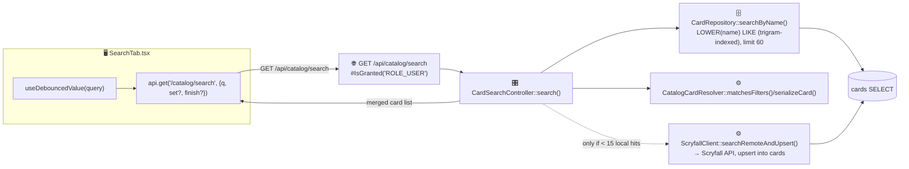
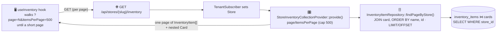
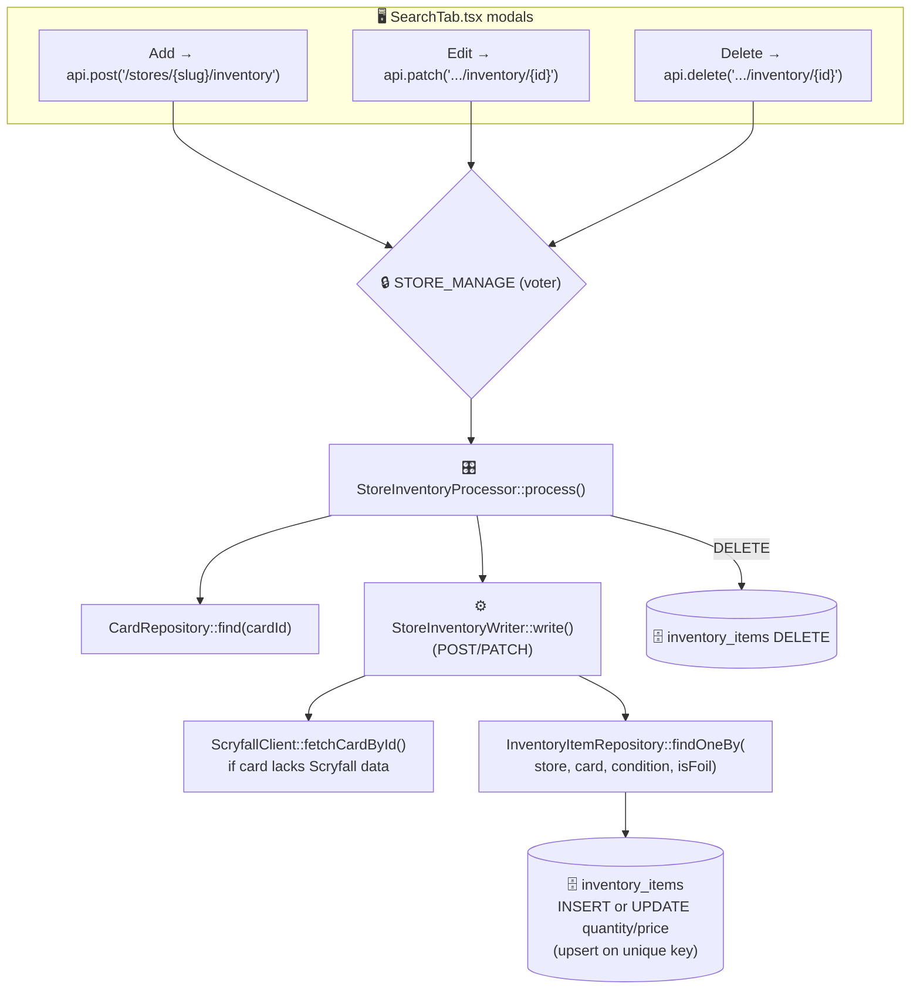
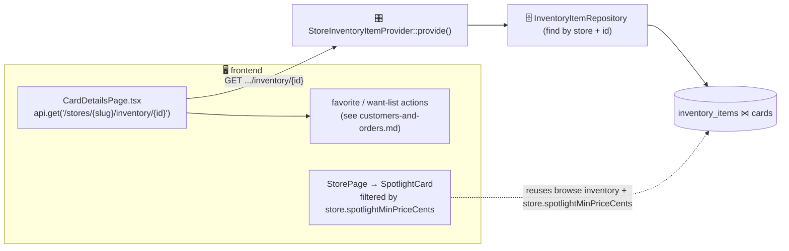
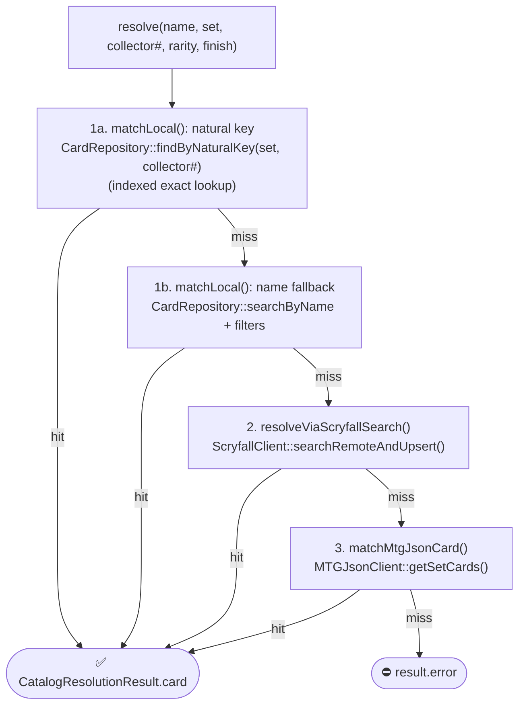

# Catalog & inventory

Covers card catalog search, browsing a store's inventory, inventory CRUD (owner), Scryfall bulk sync, the card details page, and the spotlight carousel.

- **`cards`** is a shared, global catalog (no `store_id`) synced from Scryfall.
- **`inventory_items`** is store-scoped (`store_id`) and unique per `(store, card, condition, is_foil)`.
- Inventory GET/POST/PATCH/DELETE are **API Platform operations** on `InventoryItem` delegating to State Providers/Processors; catalog search and Scryfall sync are **custom controllers**.

| Operation | Route | Backend |
|-----------|-------|---------|
| Catalog search | `GET /api/catalog/search` | `CardSearchController` |
| Browse inventory | `GET /api/stores/{slug}/inventory` | `StoreInventoryCollectionProvider` |
| Inventory item | `GET /api/stores/{slug}/inventory/{id}` | `StoreInventoryItemProvider` |
| Add inventory | `POST /api/stores/{slug}/inventory` | `StoreInventoryProcessor` |
| Edit inventory | `PATCH /api/stores/{slug}/inventory/{id}` | `StoreInventoryProcessor` |
| Delete inventory | `DELETE /api/stores/{slug}/inventory/{id}` | `StoreInventoryProcessor` |
| Scryfall sync | `POST /api/admin/scryfall/sync` | `ScryfallSyncController` |

---

## Catalog search



**Local-first**: the local catalog (trigram-indexed `LIKE`) is searched first; the Scryfall live search + upsert only runs when the filtered local result set is thin (fewer than `REMOTE_FALLBACK_THRESHOLD = 15` cards). As bulk syncs and past imports fill the `cards` table, per-keystroke remote API calls and catalog writes disappear.

| Layer | Where |
|-------|-------|
| Frontend | `pages/store-admin/SearchTab.tsx`, `hooks/useDebouncedValue.ts` |
| Route | `GET /api/catalog/search` (auth required) |
| Entry | `Controller/CardSearchController::search()` |
| Service | `Service/Catalog/CatalogCardResolver`, `Service/Scryfall/ScryfallClient` |
| Repo/DB | `CardRepository::searchByName` → `cards` (read, possible upsert) |

---

## Browse store inventory



The collection is **server-paginated** (`?page=` / `?itemsPerPage=`, capped at 500/page, ordered by card name with `id` as a stable tiebreaker) so a single request never hydrates a store's whole inventory — the response size and backend memory stay bounded no matter how large a store grows. `useInventory` walks the pages sequentially and aggregates them, so page components still receive the complete list; filtering (search, set, color, price, foil) and UI pagination happen **client-side** over that aggregate. Card tiles render via `components/cards/CardTile.tsx`.

---

## Inventory CRUD (store owner)



- The unique key `(store, card, condition, is_foil)` means adding a card that already exists **merges** into the existing line (quantity/price update) rather than duplicating. A PATCH that would collide with another line also merges.
- `StoreInventoryWriter` lazily enriches the `Card` from Scryfall (prices/images) when needed.
- **Concurrency:** the immediate web write path (`flush=true`) merges via a native `INSERT … ON CONFLICT (store_id, card_id, condition, is_foil) DO UPDATE SET quantity = quantity + EXCLUDED.quantity`, so two simultaneous adds to the same line can neither collide on the unique index nor lose an increment (the old check-then-insert + read-modify-write). The batch import path (`flush=false`) instead applies into the shared unit of work and lets the CSV handler flush and recover the whole batch. `inventory_items.version` (optimistic lock) additionally turns any stale ORM update into a fail-fast conflict rather than silent stock drift.

| Layer | Where |
|-------|-------|
| Frontend | `pages/store-admin/SearchTab.tsx` (add/edit/delete modals) |
| Routes | `POST/PATCH/DELETE /api/stores/{slug}/inventory[/{id}]` |
| Entry | `State/StoreInventoryProcessor.php`, `State/StoreInventoryItemProvider.php` |
| Service | `Service/Inventory/StoreInventoryWriter`, `Service/Scryfall/ScryfallClient` |
| Repo/DB | `InventoryItemRepository`, `CardRepository` → `inventory_items`, `cards` |

---

## Card details & spotlight



The **spotlight carousel** on the storefront isn't a separate endpoint — it filters the already-loaded inventory by the store's `spotlightMinPriceCents` (configured in `SpotlightTab.tsx` via `PATCH /stores/{slug}/settings`) and sorts by market price.

---

## Scryfall bulk sync

The HTTP endpoint **dispatches** a `SyncScryfallCatalogMessage` and returns `202` immediately — the multi-minute (`oracle_cards`) to multi-hour (`default_cards`) download + upsert runs in a messenger worker (`SyncScryfallCatalogMessageHandler`), not inline in the request, so it can't be killed by a proxy/FPM timeout. The CLI runs the same `syncBulkCards()` synchronously for interactive use.

```mermaid
sequenceDiagram
    participant Trigger as CLI app:scryfall:sync (sync) / POST /api/admin/scryfall/sync (→ queue)
    participant Ctl as ScryfallSyncCommand / Controller+Worker
    participant SC as ScryfallClient::syncBulkCards(type)
    participant API as Scryfall bulk API
    participant UP as ScryfallCardUpserter
    participant DB as cards table

    Trigger->>Ctl: (ROLE_SUPER_ADMIN; endpoint dispatches to worker, returns 202)
    Ctl->>SC: syncBulkCards(onProgress, type)
    SC->>API: getBulkInfo(type) → stream JSON to temp file
    loop JsonMachine streams one card at a time, batches of 200
        SC->>UP: upsertMany(batch)
        UP->>DB: multi-row INSERT … ON CONFLICT (id) DO UPDATE
    end
    SC-->>Ctl: {inserted, updated, total}
```

Two datasets (`ScryfallClient::BULK_TYPES`):

- **`default_cards`** (CLI default) — **every printing** (~450k rows). This is the dataset that lets the catalog resolve store imports (which identify a printing by set + collector number) without any API fallback. Run via `php bin/console app:scryfall:sync` (streams, safe to run long; schedule via cron to keep prices fresh).
- **`oracle_cards`** (HTTP endpoint default) — one representative printing per Oracle ID (~35k rows). Smaller/faster; enough for rules text and name search, **not** enough to resolve printings. The synchronous admin endpoint defaults to this so the request stays inside HTTP timeouts; it accepts `{"type": "default_cards"}` but the CLI is the recommended path for full syncs.

The whole pipeline is **streaming + ORM-free**: the bulk body is streamed to a temp file, `JsonMachine` iterates the top-level array without materialising it, and `ScryfallCardUpserter` writes multi-row native `INSERT … ON CONFLICT (id) DO UPDATE` batches — no decoded card list, no entity hydration, no unit-of-work growth. Memory stays flat even for the multi-hundred-MB `default_cards` file, and `ON CONFLICT` makes concurrent writes (sync racing import workers) safe.

| Layer | Where |
|-------|-------|
| Trigger | `Command/ScryfallSyncCommand` (`--type=`) or `Controller/ScryfallSyncController::sync()` |
| Service | `Service/Scryfall/ScryfallClient::syncBulkCards` |
| Writer | `Service/Scryfall/ScryfallCardUpserter` → `cards` (native upsert) |

---

## Card resolution cascade

Shared by catalog search and CSV import. `CatalogCardResolver::resolve(name, setCode, collectorNumber, rarity, finish)` returns a `CatalogResolutionResult`:



Local matching tries the **printing natural key first** — `(set_code, collector_number)` via the `idx_card_set_collector` expression index — and only falls back to name search for rows without a collector number. Name comparison is tolerant of multi-face formats: `"Fire // Ice"`, `"Fire//Ice"`, and front-face-only `"Fire"` all match the catalog's `"Fire // Ice"`.

The CSV import worker adds a **batch layer** above this cascade: each claimed batch is pre-resolved with local natural-key matches plus ONE Scryfall collection call (75 identifiers/request) for the misses, so `resolve()`'s per-row remote legs only run for rows the batch couldn't place (see [csv-import.md](csv-import.md)).

Scryfall is attempted before MTGJSON so normal failed-row recovery and CSV retry paths avoid downloading large set files when the exact printing can be found by Scryfall search. MTGJSON remains the final fallback, and oversized/problematic set payloads are skipped to keep the worker within memory limits.

| Layer | Where |
|-------|-------|
| Resolver | `Service/Catalog/CatalogCardResolver`, DTO `DTO/CatalogResolutionResult` |
| Sources | `CardRepository` (local), `Service/MTGJson/MTGJsonClient`, `Service/Scryfall/ScryfallClient` |

---

## Scryfall API discipline

All live Scryfall calls (`searchRemoteAndUpsert`, `fetchCardById`, `fetchCollectionBySetCollectors`) go through two shared safeguards in `Service/Scryfall/`:

- **`ScryfallRateLimiter`** — a cross-process throttle (~8 req/s) serialised through an `flock()`'d timestamp file, so any number of web workers + messenger workers on a host share ONE budget instead of multiplying it. (Single-host only; move to a Redis token bucket if the app is ever scaled across machines.)
- **`ScryfallCardUpserter`** — every card payload is written with native `INSERT … ON CONFLICT (id) DO UPDATE`, so concurrent workers upserting the same card can never collide on the primary key (the old find→persist→flush path crashed whole import batches on that race). After an upsert, `ScryfallClient` re-reads the entity with `refresh()` so the ORM identity map never serves stale data.
