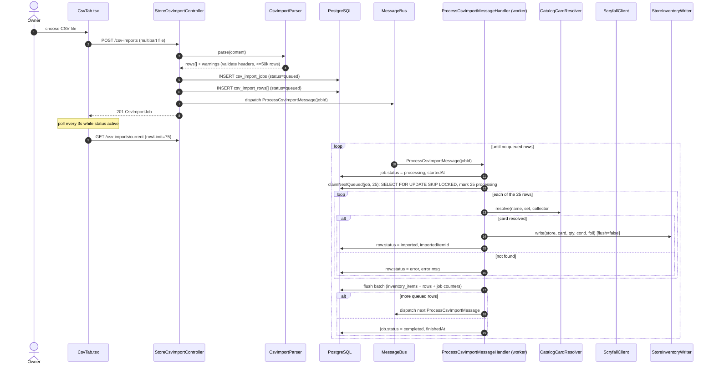
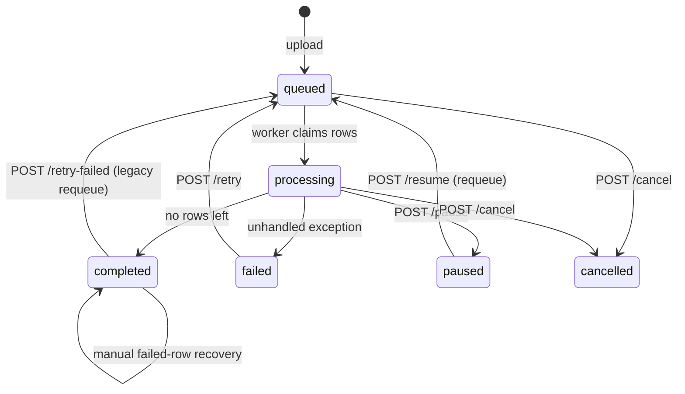
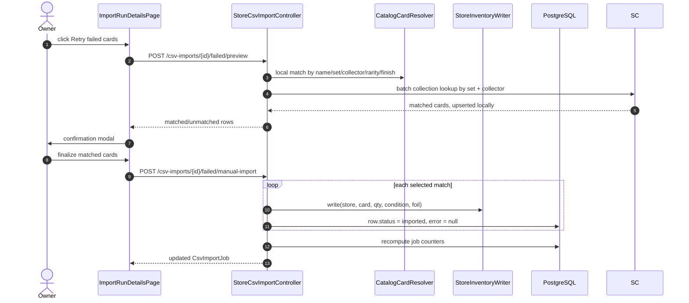
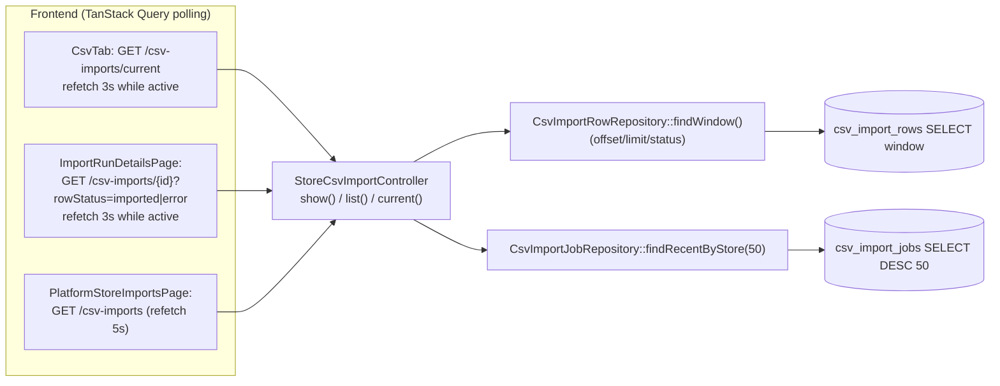

# CSV import

Bulk inventory import via CSV. Uploads are parsed, persisted as a job plus rows, then processed in the background by a Symfony Messenger worker that resolves each card and writes inventory. The frontend polls for progress.

> Requires a running worker. Rows stay `queued` until `php bin/console messenger:consume async` is running. Transport: `doctrine://default?queue_name=csv_import` (see [messenger.yaml](../backend/config/packages/messenger.yaml)).

All routes are under `StoreCsvImportController` at `/api/stores/{slug}/csv-imports`, gated by `ROLE_USER` and `STORE_MANAGE`.

| Action | Route |
|--------|-------|
| Upload | `POST /api/stores/{slug}/csv-imports` |
| List runs | `GET /api/stores/{slug}/csv-imports` |
| Current run | `GET /api/stores/{slug}/csv-imports/current` |
| Run detail (+ row window) | `GET /api/stores/{slug}/csv-imports/{id}` |
| Pause / Resume / Retry / Retry-failed / Cancel | `POST /api/stores/{slug}/csv-imports/{id}/{action}` |
| Preview failed row matches | `POST /api/stores/{slug}/csv-imports/{id}/failed/preview` |
| Finalize matched failed rows | `POST /api/stores/{slug}/csv-imports/{id}/failed/manual-import` |
| Manually resolve one failed row | `POST /api/stores/{slug}/csv-imports/{id}/rows/{rowIndex}/manual-import` |

---

## Full lifecycle

---

## Why batched + self-dispatching?

Rather than one long-running handler, each message processes **25 rows** then enqueues the next batch. This gives:

- **Exactly-once rows** - `CsvImportRowRepository::claimNextQueued()` wraps a `SELECT ... FOR UPDATE SKIP LOCKED` plus `UPDATE ... status='processing'` in a transaction, so concurrent workers never grab the same rows and a crash mid-batch does not double-import.
- **Bounded memory / flushes** - inventory writes use `flush=false` and are flushed once per batch, not per row.
- **Progress visibility** - job counters (`processed/imported/failed_rows`) are recomputed and flushed each batch, so polling shows steady movement.

Row states: `queued -> processing -> imported | error`. The legacy `retry-failed` endpoint flips `error` rows back to `queued` and re-dispatches. The owner-facing failed-card flow now previews matches and moves confirmed rows directly from `error` to `imported`.

---

## Failed row recovery

Failed rows can be recovered without re-running the worker:

- `failed/preview` checks local cards first, then uses Scryfall's collection endpoint in 75-card batches by set + collector number. This avoids one HTTP search per failed row.
- The confirmation modal shows matched cards and rows that still need review. Finalize imports only the matched rows.
- `rows/{rowIndex}/manual-import` powers the one-row Resolve button from the failed table.
- Both manual import paths use the same `StoreInventoryWriter`, so recovered rows merge into existing inventory lines by `(store, card, condition, is_foil)`.

---

## Status polling & run details

The detail page renders two windows: imported rows (paginated) and failed rows. It also exposes pause/resume/retry/cancel controls, per-row Resolve actions, and the batch Retry failed cards review modal. Polling switches off automatically once the job reaches a terminal state (`completed/failed/cancelled/paused`).

---

## Where to go

| Concern | File |
|---------|------|
| HTTP endpoints | `Controller/StoreCsvImportController.php` |
| CSV parsing & header aliases | `Service/CsvImport/CsvImportParser.php` |
| Async message + handler | `Message/ProcessCsvImportMessage.php`, `MessageHandler/ProcessCsvImportMessageHandler.php` |
| Row claiming / counters | `Repository/CsvImportRowRepository.php` (`claimNextQueued`, `countByStatus`, `findWindow`, `retryFailedRows`) |
| Job persistence | `Repository/CsvImportJobRepository.php`, `Entity/CsvImportJob.php`, `Entity/CsvImportRow.php` |
| Card resolution | `Service/Catalog/CatalogCardResolver.php` (see [catalog-and-inventory.md](catalog-and-inventory.md#card-resolution-cascade)) |
| Inventory write | `Service/Inventory/StoreInventoryWriter.php` |
| Transport config | `config/packages/messenger.yaml` |
| Frontend | `pages/store-admin/CsvTab.tsx`, `ImportRunDetailsPage.tsx`, `csv-shared.tsx`, `pages/PlatformStoreImportsPage.tsx` |
| DB tables | `csv_import_jobs`, `csv_import_rows`, `messenger_messages`, `inventory_items`, `cards` |
