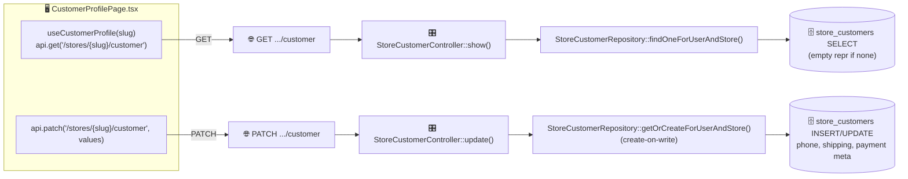
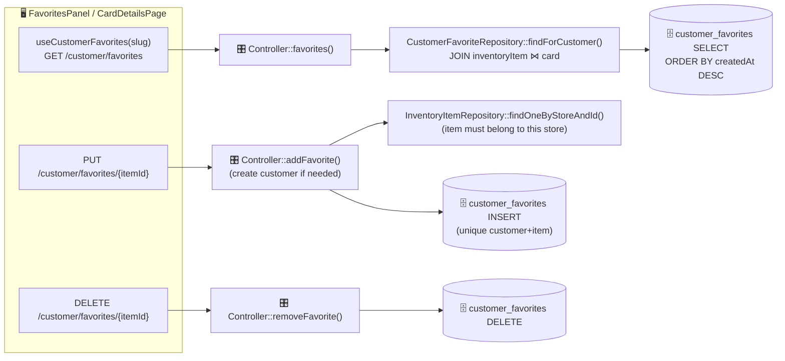
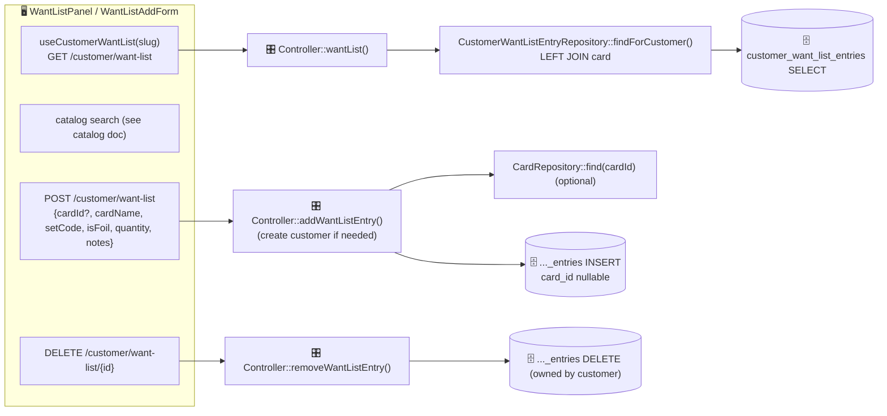
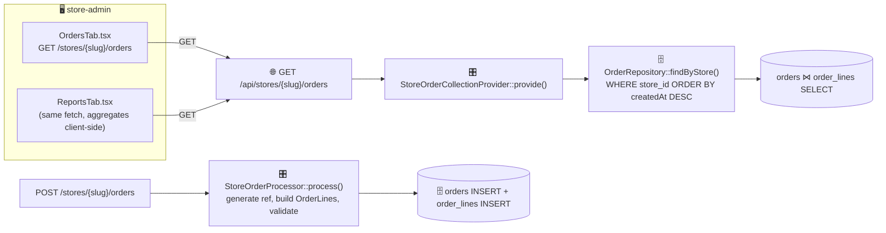

# Customers & orders

Covers per-store customer profiles, favorites, want lists (all via the `StoreCustomerController`), plus orders and sales reports (API Platform `Order` resource).

A **`StoreCustomer`** links a global `User` to a specific `Store` (unique per `user_id + store_id`). Favorites and want-list entries hang off that customer row.

**Create-on-write:** `GET` endpoints never create rows — they return empty if the user has no `StoreCustomer` at that store yet. The row is created lazily on the first `PUT`/`POST`/`PATCH`.

All customer routes are under `StoreCustomerController` at `/api/stores/{slug}/customer`, gated by `ROLE_USER`.

| Feature | Route(s) |
|---------|----------|
| Profile | `GET` / `PATCH /api/stores/{slug}/customer` |
| Favorites | `GET /favorites`, `PUT /favorites/{itemId}`, `DELETE /favorites/{itemId}` |
| Want list | `GET /want-list`, `POST /want-list`, `DELETE /want-list/{id}` |
| Orders | `GET/POST /api/stores/{slug}/orders`, `GET /orders/{id}` |

---

## Customer profile

`update()` validates payment metadata (last4 = 4 digits, expiry `MM/YY`) before persisting. No card numbers stored — only brand/last4/expiry.

---

## Favorites

The favorited item must belong to the customer's store (validated via `findOneByStoreAndId`). Unique `(customer, inventory_item)` prevents duplicates; `PUT` is idempotent.

---

## Want list

`card_id` is optional — you can want a card that isn't in the local catalog (stored by name/set). No unique constraint, so duplicates with different specs are allowed.

| Layer | Where |
|-------|-------|
| Frontend | `pages/CustomerProfilePage.tsx`, `hooks/useCustomer.ts` |
| Controller | `Controller/StoreCustomerController.php` |
| Repos | `StoreCustomerRepository`, `CustomerFavoriteRepository`, `CustomerWantListEntryRepository`, `InventoryItemRepository`, `CardRepository` |
| DB | `store_customers`, `customer_favorites`, `customer_want_list_entries` |

---

## Orders & sales reports

Orders are an **API Platform resource** (`Order`), store-scoped via the tenant filter and gated by `STORE_MANAGE`.

- **Reports** reuse the orders list — revenue, pending, refunded totals, average order value, and per-status breakdown are all computed **client-side** in `ReportsTab.tsx`. There's no backend aggregation endpoint.
- **`StoreOrderProcessor`** generates the unique `ORD-xxxxxxxx` reference, resolves optional card references, and builds `OrderLine` rows (validating quantity ≥ 1, price ≥ 0).
- Order status transitions follow the `OrderStatus` enum (`pending → paid → shipped → completed`, or `cancelled`/`refunded`).

| Layer | Where |
|-------|-------|
| Frontend | `pages/store-admin/OrdersTab.tsx`, `ReportsTab.tsx` |
| Routes | `GET/POST /api/stores/{slug}/orders`, `GET /orders/{id}` |
| Entry | `State/StoreOrderCollectionProvider.php`, `StoreOrderItemProvider.php`, `StoreOrderProcessor.php` |
| Repo/DB | `OrderRepository`, `OrderLineRepository`, `CardRepository` → `orders`, `order_lines` |
