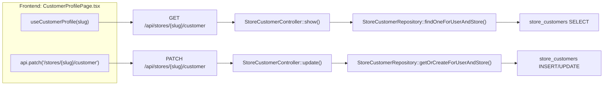
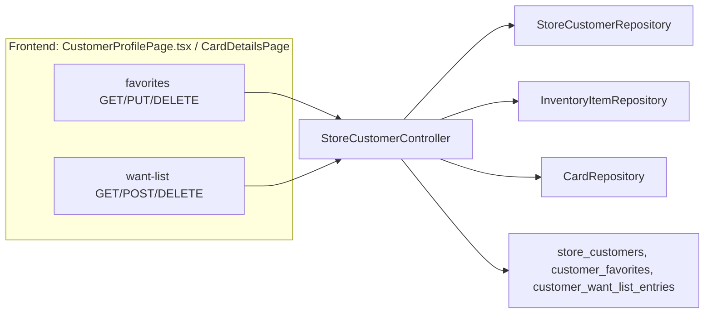
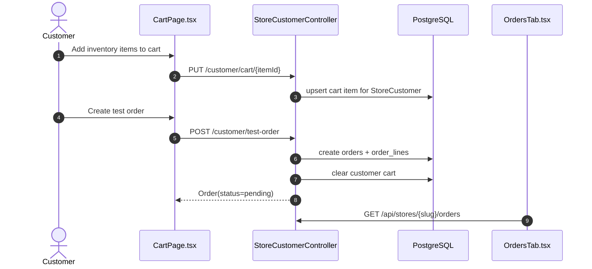
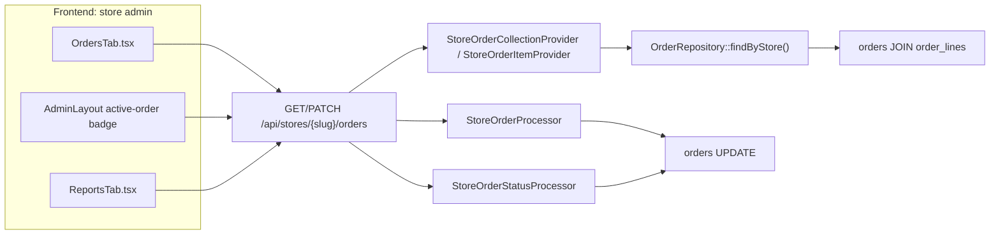
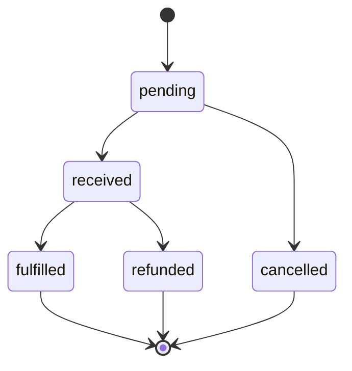
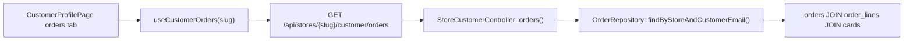
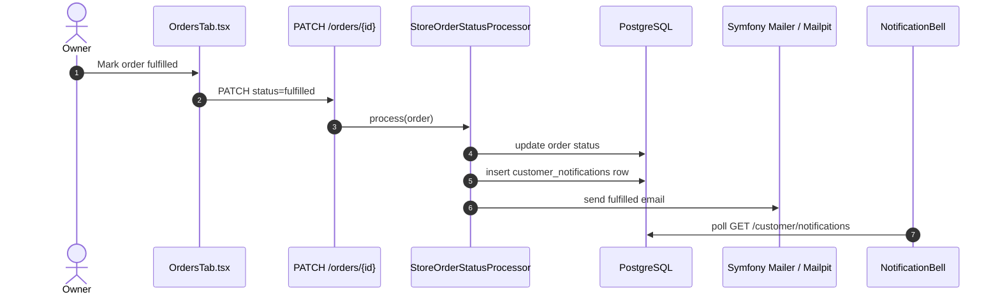

# Customers & orders

Covers per-store customer profiles, favorites, want lists, customer carts, local test orders, owner order management, customer order history, notifications, and sales reports.

A `StoreCustomer` links a global `User` to a specific `Store` with a unique `user_id + store_id` pair. Favorites and want-list entries hang off that customer row.

Create-on-write: read endpoints do not create customer rows. They return an empty representation if the user has no `StoreCustomer` yet, and the row is created lazily on the first write.

Customer routes are under `StoreCustomerController` at `/api/stores/{slug}/customer`, gated by `ROLE_USER`. Owner order routes are API Platform `Order` operations under `/api/stores/{slug}/orders`, gated by `STORE_MANAGE`.

| Feature | Route(s) |
|---------|----------|
| Profile | `GET /api/stores/{slug}/customer`, `PATCH /api/stores/{slug}/customer` |
| Favorites | `GET /favorites`, `PUT /favorites/{itemId}`, `DELETE /favorites/{itemId}` |
| Want list | `GET /want-list`, `POST /want-list`, `DELETE /want-list/{id}` |
| Cart | `GET /cart`, `PUT /cart/{itemId}`, `DELETE /cart/{itemId}`, `DELETE /cart` |
| Local test order | `POST /test-order` |
| Customer order history | `GET /orders` |
| Customer notifications | `GET /notifications`, `PATCH /notifications/{id}/read` |
| Owner orders | `GET /api/stores/{slug}/orders`, `POST /api/stores/{slug}/orders`, `GET /api/stores/{slug}/orders/{id}`, `PATCH /api/stores/{slug}/orders/{id}` |

---

## Customer profile

`update()` validates payment metadata before persisting. No card numbers are stored; only brand, last4, and expiry metadata are accepted.

---

## Favorites and want list

Favorites point at concrete `InventoryItem` rows, so the favorited item must belong to the requested store. Want-list entries may point at a shared catalog `Card`, but `card_id` is optional so customers can request cards that are not in the local catalog yet.

| Layer | Where |
|-------|-------|
| Frontend | `pages/CustomerProfilePage.tsx`, `hooks/useCustomer.ts`, `components/cards/*` |
| Controller | `Controller/StoreCustomerController.php` |
| Repos | `StoreCustomerRepository`, `CustomerFavoriteRepository`, `CustomerWantListEntryRepository`, `InventoryItemRepository`, `CardRepository` |
| DB | `store_customers`, `customer_favorites`, `customer_want_list_entries` |

---

## Cart and local test checkout

The cart is customer-scoped and store-scoped. In local development, the cart can be converted into an unpaid `pending` order without Square.

- `POST /customer/test-order` is available only in `dev` and `test`. In other environments the controller returns `404`.
- The test order path does not charge Square or PayPal. It exists so order history, owner fulfillment, print sheets, notifications, and Mailpit email can be tested locally.
- The frontend exposes the action when `import.meta.env.DEV` or `VITE_ENABLE_TEST_CHECKOUT=true`.

---

## Owner order management

Orders are API Platform resources. Store owners read orders through `StoreOrderCollectionProvider`, can create manual orders through `StoreOrderProcessor`, and update status through `StoreOrderStatusProcessor`.

Current primary workflow:

Legacy statuses are still accepted for existing data and reports: `paid`, `shipped`, and `completed`. The frontend normalizes `paid` and `shipped` into the active received step and treats `completed` as fulfilled.

The order detail panel includes a print sheet action. The print sheet renders order reference, date, customer, card name, set, collector number, quantity, unit price, line total, pre-tax total, tax, and post-tax total. Tax is currently displayed as `$0.00` because tax calculation is not persisted yet.

---

## Customer order history

Customers see their own store-specific order history from the profile page.

Orders are matched by the authenticated user's email and the current store. Serialized lines include card images, set code, and collector number so the profile page can show the ordered card image and printing details.

---

## Notifications and email

In-app notifications are persisted in `customer_notifications`; email is a delivery side effect. The database notification is the source of truth for the bell, unread count, and profile notification list.

- A notification is created when an order first transitions to `fulfilled` or legacy `completed`.
- The processor looks up the `User` by `orders.customer_email`. If no matching user exists, no customer notification is created.
- Duplicate fulfilled notifications are prevented by checking `(user, order, type)`.
- Mail delivery uses Symfony Mailer. Local development sends to Mailpit via `MAILER_DSN=smtp://127.0.0.1:1025`; the UI is at `http://localhost:8025`.
- If Mailpit is not running, the processor catches transport errors so the in-app notification is still saved.
- The frontend polls notifications every 15 seconds and refetches on mount, reconnect, and window focus. Realtime SSE/WebSocket delivery is a future upgrade.

| Layer | Where |
|-------|-------|
| Backend entity | `Entity/CustomerNotification.php` |
| Backend repo | `Repository/CustomerNotificationRepository.php` |
| Fulfillment side effects | `State/StoreOrderStatusProcessor.php` |
| Customer routes | `Controller/StoreCustomerController.php` |
| Frontend hooks | `hooks/useCustomer.ts` |
| Frontend UI | `components/notifications/NotificationBell.tsx`, `NotificationList.tsx`, `pages/CustomerProfilePage.tsx` |
| DB | `customer_notifications` |

---

## Reports

Reports reuse the owner orders list. Revenue totals, pending/refunded totals, average order value, and per-status breakdown are computed client-side in `ReportsTab.tsx`. There is no backend aggregation endpoint yet.

| Layer | Where |
|-------|-------|
| Frontend | `pages/store-admin/OrdersTab.tsx`, `ReportsTab.tsx`, `components/orders/*`, `lib/orders.ts` |
| Routes | `GET /api/stores/{slug}/orders`, `POST /api/stores/{slug}/orders`, `GET /api/stores/{slug}/orders/{id}`, `PATCH /api/stores/{slug}/orders/{id}`, `POST /api/stores/{slug}/customer/test-order` |
| API Platform entry | `State/StoreOrderCollectionProvider.php`, `StoreOrderItemProvider.php`, `StoreOrderProcessor.php`, `StoreOrderStatusProcessor.php` |
| Customer controller | `Controller/StoreCustomerController.php` |
| Repo/DB | `OrderRepository`, `OrderLineRepository`, `CustomerNotificationRepository`, `CardRepository` -> `orders`, `order_lines`, `customer_notifications`, `cards` |

## Known gaps

- Real payment capture is not wired into checkout yet. Square OAuth account linking exists, but test orders bypass payment providers.
- Tax and shipping are not calculated or stored on orders yet.
- Notifications are polling-based, not pushed in realtime.
- Fulfillment email is plain text and does not use templates or per-user notification preferences yet.
