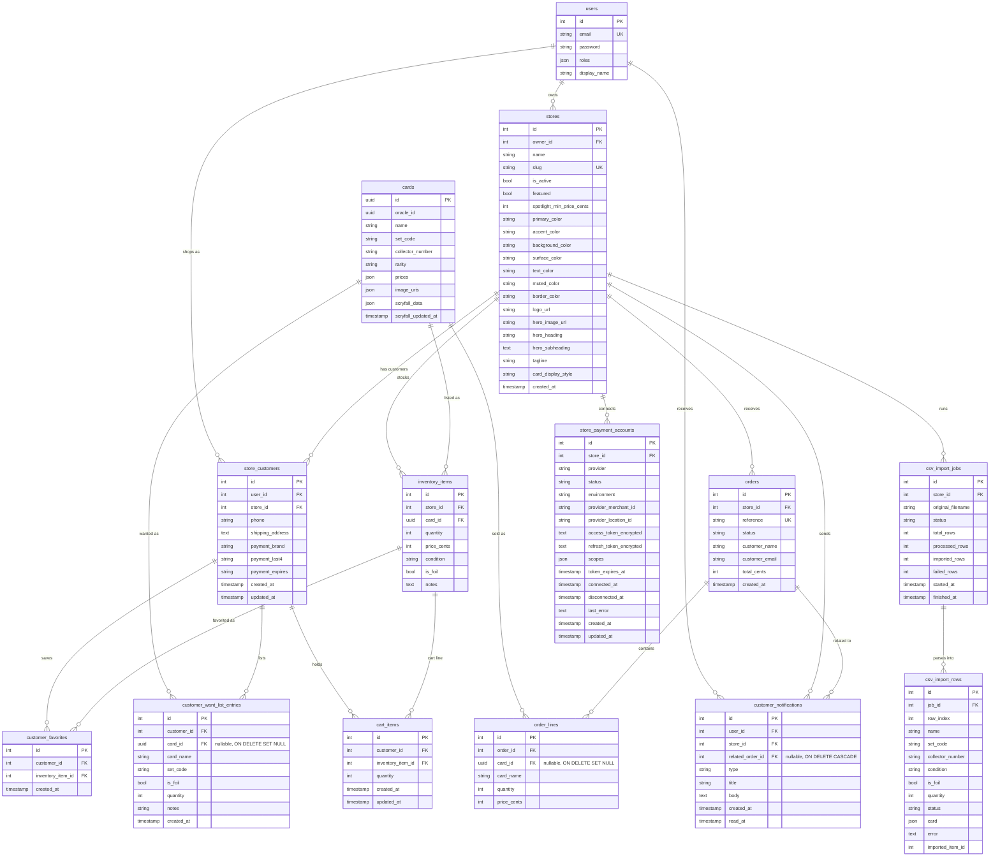

# Data model

PostgreSQL 16. Doctrine migrations in `backend/migrations/` create the schema. Card data uses UUID primary keys from Scryfall; most application-owned records use auto-increment integer IDs.

## Entity relationship diagram

`messenger_messages` is not shown. It is the Symfony Messenger Doctrine transport table used by async CSV import jobs.

## Multi-tenancy pattern

The tenant discriminator is `store_id`.

| Group | Tables | How they are scoped |
|-------|--------|---------------------|
| Tenant root | `stores` | Resolved from the URL slug |
| Directly scoped | `inventory_items`, `orders`, `csv_import_jobs`, `store_customers`, `store_payment_accounts`, `customer_notifications` | Have a `store_id` column. `inventory_items` and `orders` are additionally enforced by `TenantFilter` at the SQL level |
| Transitively scoped | `order_lines`, `csv_import_rows`, `cart_items`, `customer_favorites`, `customer_want_list_entries` | Reached through a directly scoped parent |
| Global/shared | `users`, `cards` | `users` are global identities; `cards` is the shared catalog |

See [auth-and-tenancy.md](auth-and-tenancy.md#multi-tenancy-filter) for request-time filter behavior.

## Enums and constrained values

| Value set | Column | Values |
|-----------|--------|--------|
| `CardCondition` | `inventory_items.condition` | `NM`, `LP`, `MP`, `HP`, `DMG` |
| `OrderStatus` | `orders.status` | `pending`, `received`, `fulfilled`, `paid`, `shipped`, `completed`, `cancelled`, `refunded` |
| Card display style | `stores.card_display_style` | `gallery`, `marketplace` |
| Payment provider | `store_payment_accounts.provider` | `square` today; PayPal can be added later |
| Payment status | `store_payment_accounts.status` | `connected`, `disconnected`, `error` |
| Notification type | `customer_notifications.type` | `order_fulfilled` today |

## Key constraints

- `users.email` is unique.
- `stores.slug` is unique.
- `inventory_items` is unique on `(store_id, card_id, condition, is_foil)`, so each store has one inventory line per card/condition/foil combination.
- `orders.reference` is unique and generated as `ORD-xxxxxxxx`.
- `store_customers` is unique on `(user_id, store_id)`, giving one customer profile per user per store.
- `cart_items` is unique on `(customer_id, inventory_item_id)`.
- `customer_favorites` is unique on `(customer_id, inventory_item_id)`.
- `store_payment_accounts` is unique on `(store_id, provider)`.
- `customer_notifications` indexes user/store/order lookups for the notification bell and order fulfillment dedupe.
- `cards` is indexed on `name` and `oracle_id`, plus two scaling indexes (migration `Version20260718090000`):
  - `idx_card_set_collector` on `(LOWER(set_code), LOWER(collector_number))` — the **natural key of a printing**. Import resolution matches on this (indexed, exact) instead of scanning by name substring, so lookups stay fast as the catalog grows toward every MTG printing.
  - `idx_card_name_trgm`, a `pg_trgm` GIN index on `LOWER(name)` — makes the catalog's leading-wildcard `LIKE '%…%'` searches index-backed instead of sequential scans.

## Security-sensitive storage

- Store customer payment fields are metadata only: card brand, last4, and expiry. Full card numbers are not stored.
- `store_payment_accounts.access_token_encrypted` and `refresh_token_encrypted` hold provider tokens after encryption by `SecretCipher`.
- Payment status serialization intentionally excludes provider tokens.
