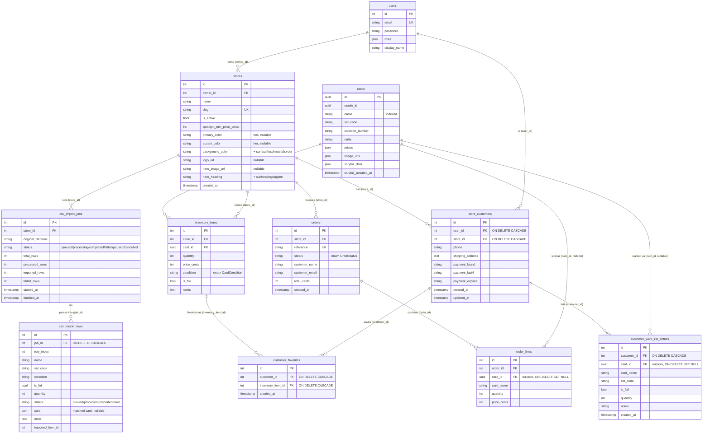

# Data model

PostgreSQL 16. All tables are created by the Doctrine migrations in `backend/migrations/`. Card data uses UUID primary keys (from Scryfall); everything else uses auto-increment integers.

## Entity–relationship diagram

> Not shown: `messenger_messages` — the Symfony Messenger Doctrine transport table (queue for async CSV jobs). No FKs; columns `body`, `headers`, `queue_name`, `created_at`, `available_at`, `delivered_at`.

## Multi-tenancy pattern

The tenant discriminator is **`store_id`**. Tables split into these groups:

| Group | Tables | How they're scoped |
|-------|--------|--------------------|
| **Tenant root** | `stores` | The tenant itself, resolved from the URL slug |
| **Directly scoped** | `inventory_items`, `orders`, `csv_import_jobs`, `store_customers` | Have a `store_id` column. `inventory_items` and `orders` are additionally enforced by the Doctrine `TenantFilter` at the SQL level |
| **Transitively scoped** | `order_lines` (→ `orders`), `csv_import_rows` (→ `csv_import_jobs`), `customer_favorites` / `customer_want_list_entries` (→ `store_customers`) | Reached only through a scoped parent |
| **Global / shared** | `users`, `cards` | Not tenant-scoped. `cards` is a shared catalog across all stores; `users` are global identities that gain per-store `store_customers` rows |

See [auth-and-tenancy.md](auth-and-tenancy.md#multi-tenancy-filter) for how the filter is toggled per request.

## Enums

Both are PHP backed enums stored as strings.

| Enum | Column | Values |
|------|--------|--------|
| `CardCondition` (`src/Enum/CardCondition.php`) | `inventory_items.condition` | `NM`, `LP`, `MP`, `HP`, `DMG` |
| `OrderStatus` (`src/Enum/OrderStatus.php`) | `orders.status` | `pending`, `paid`, `shipped`, `completed`, `cancelled`, `refunded` |

## Key constraints

- `users.email` — unique (`UNIQ_USER_EMAIL`)
- `stores.slug` — unique (`UNIQ_STORE_SLUG`)
- `inventory_items` — unique on `(store_id, card_id, condition, is_foil)` (`UNIQ_INVENTORY_STORE_CARD`) → one line per condition/foil combination; writes upsert into it
- `orders.reference` — unique (format `ORD-xxxxxxxx`)
- `store_customers` — unique on `(user_id, store_id)` → one customer profile per user per store
- `customer_favorites` — unique on `(customer_id, inventory_item_id)`
- `cards` — indexed on `name` and `oracle_id` for search
