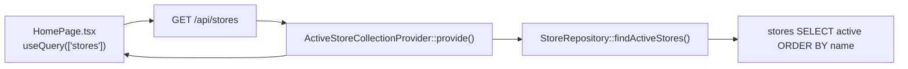
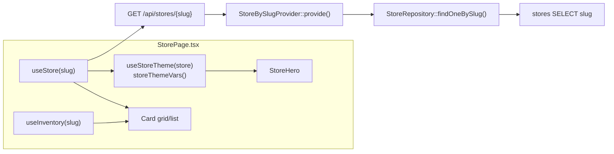
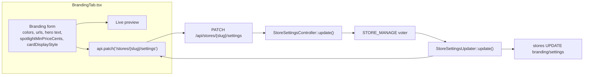
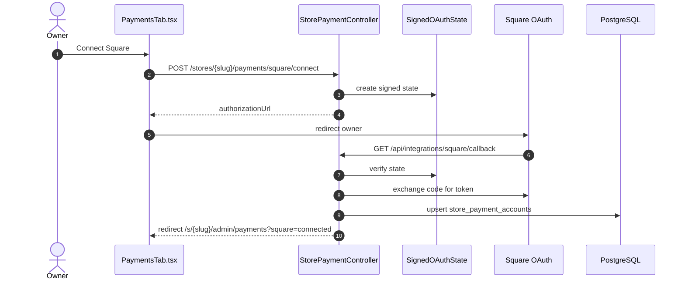
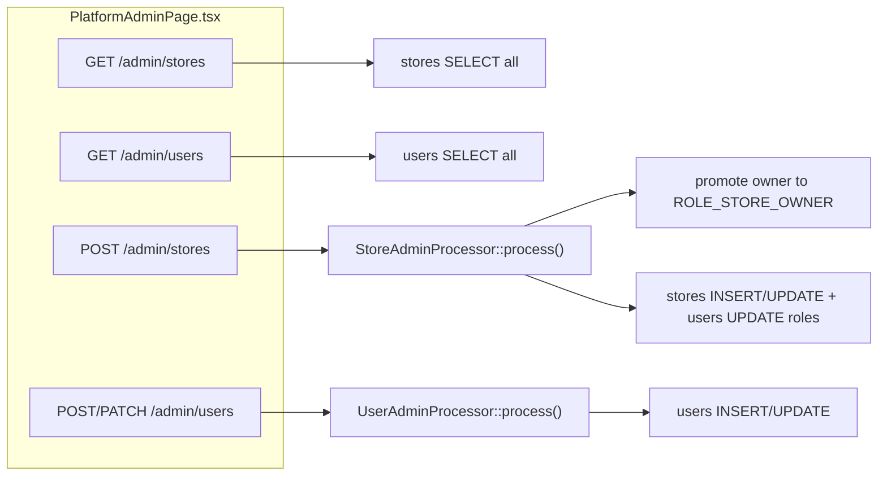

# Stores & branding

Covers the public store directory, storefront-by-slug page, branding/theme editor, store payment connections, and platform-admin management of stores and users.

`Store` is an API Platform resource. Public GET operations use state providers, admin writes use `StoreAdminProcessor`, and owner-managed branding/settings writes go through `StoreSettingsController`.

| Operation | Route | Backend |
|-----------|-------|---------|
| List active stores | `GET /api/stores` | `ActiveStoreCollectionProvider` |
| Store by slug | `GET /api/stores/{slug}` | `StoreBySlugProvider` |
| Admin list stores | `GET /api/admin/stores` | API Platform default, super-admin only |
| Admin create store | `POST /api/admin/stores` | `StoreAdminProcessor` |
| Admin update store | `PATCH /api/admin/stores/{id}` | `StoreAdminProcessor` |
| Update branding/settings | `PATCH /api/stores/{slug}/settings` | `StoreSettingsController` |
| Payment status | `GET /api/stores/{slug}/payments` | `StorePaymentController` |
| Square connect/disconnect | `POST /api/stores/{slug}/payments/square/connect`, `POST /api/stores/{slug}/payments/square/disconnect` | `StorePaymentController` |
| Square OAuth callback | `GET /api/integrations/square/callback` | `StorePaymentController` |

---

## Browse store directory

Public, no auth. Returns active stores serialized with the `store:read` group, including public branding fields.

---

## View a storefront by slug

The store's branding columns become CSS custom properties and rendering options. `cardDisplayStyle` controls how inventory cards render on the storefront:

- `gallery` - compact image-first grid.
- `marketplace` - card-detail layout with add-to-cart action.

Inventory is fetched separately; see [catalog-and-inventory.md](catalog-and-inventory.md#browse-store-inventory).

| Layer | Where |
|-------|-------|
| Frontend | `pages/StorePage.tsx`, `hooks/useStore.ts`, `hooks/useStoreTheme.ts`, `lib/storeTheme.ts`, `components/store/StoreHero.tsx`, `components/cards/*` |
| Route | `GET /api/stores/{slug}` |
| Entry | `State/StoreBySlugProvider.php` |
| Repo/DB | `StoreRepository::findOneBySlug` -> `stores` |

---

## Update branding & settings

- Validation lives in `StoreSettingsUpdater`: colors must match `#RRGGBB`, URLs must start with `http(s):` or `/`, text fields have max lengths, and `cardDisplayStyle` must be `gallery` or `marketplace`.
- `StoreVoter` gates the write: store owner or super-admin only.
- The branding tab saves `cardDisplayStyle` immediately when the owner changes the display option, then keeps the local store query cache in sync with the returned store payload.

| Layer | Where |
|-------|-------|
| Frontend | `pages/store-admin/BrandingTab.tsx`, `hooks/useStore.ts` |
| Route | `PATCH /api/stores/{slug}/settings` |
| Entry | `Controller/StoreSettingsController::update()` |
| Service | `Service/Store/StoreSettingsUpdater` |
| DB | `stores` |

---

## Store payment connections

Payment provider connections belong to the store owner. Provider tokens are stored on `store_payment_accounts`, encrypted before persistence, and are never returned by the API. Platform administrators should not receive provider credentials.

- `GET /api/stores/{slug}/payments` returns sanitized provider status only.
- `POST /payments/square/connect` requires `STORE_MANAGE` and returns an authorization URL when `SQUARE_APPLICATION_ID` and `SQUARE_APPLICATION_SECRET` are configured.
- `POST /payments/square/disconnect` revokes the Square token when possible, then clears encrypted tokens and marks the account disconnected.
- The callback verifies signed OAuth state before writing the connection, so a Square response can only attach to the store/user that initiated it.
- PayPal is not implemented yet. The table and UI are provider-shaped so PayPal can follow the same status/connect/disconnect pattern later.
- Real checkout payment capture is future work. Local test orders intentionally bypass Square.

| Layer | Where |
|-------|-------|
| Frontend | `pages/store-admin/PaymentsTab.tsx` |
| Routes | `Controller/StorePaymentController.php` |
| Provider client | `Service/Payments/SquareOAuthClient.php` |
| OAuth state | `Service/Payments/SignedOAuthState.php` |
| Secret handling | `Service/Security/SecretCipher.php` |
| Repo/DB | `StorePaymentAccountRepository` -> `store_payment_accounts` |

---

## Platform admin - stores & users

- All `/api/admin/*` operations require `ROLE_SUPER_ADMIN`.
- The tenant filter is disabled for admin routes so platform administrators can manage all stores.
- Creating a store through `StoreAdminProcessor` promotes the chosen owner to `ROLE_STORE_OWNER`.
- `UserAdminProcessor` hashes `plainPassword` before persisting.

| Layer | Where |
|-------|-------|
| Frontend | `pages/PlatformAdminPage.tsx` |
| Routes | `GET/POST /api/admin/stores`, `PATCH /api/admin/stores/{id}`, `GET/POST/PATCH /api/admin/users[/{id}]` |
| Entry | `State/StoreAdminProcessor.php`, `State/UserAdminProcessor.php`, API Platform default collection providers |
| DB | `stores`, `users` |
