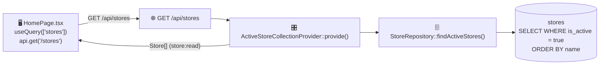
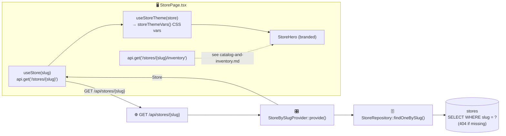
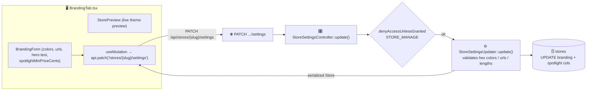
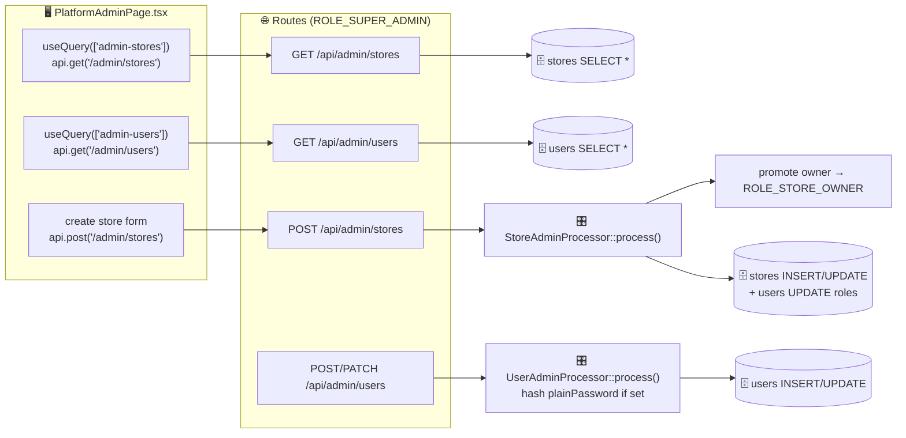

# Stores & branding

Covers the public store directory, the storefront-by-slug page, the branding/theme editor, and platform-admin management of stores and users.

`Store` is an **API Platform resource** (`#[ApiResource]` on `src/Entity/Store.php`) — its GET operations use State Providers and its admin writes use a State Processor. Branding updates go through a **custom controller** instead.

| Operation | Route | Backend |
|-----------|-------|---------|
| List active stores | `GET /api/stores` | `ActiveStoreCollectionProvider` |
| Store by slug | `GET /api/stores/{slug}` | `StoreBySlugProvider` |
| Admin list stores | `GET /api/admin/stores` | API Platform default (super-admin) |
| Admin create store | `POST /api/admin/stores` | `StoreAdminProcessor` |
| Admin update store | `PATCH /api/admin/stores/{id}` | `StoreAdminProcessor` |
| Update branding/settings | `PATCH /api/stores/{slug}/settings` | `StoreSettingsController` |

---

## Browse store directory

Public, no auth. Returns active stores serialized with the `store:read` group (name, slug, branding fields).

---

## View a storefront by slug

The store's branding columns (colors, logo, hero text) become CSS custom properties via `lib/storeTheme.ts`, so the storefront is themed per tenant. Inventory is fetched separately (see [catalog-and-inventory.md](catalog-and-inventory.md#browse-store-inventory)).

| Layer | Where |
|-------|-------|
| Frontend | `pages/StorePage.tsx`, `hooks/useStore.ts`, `hooks/useStoreTheme.ts`, `lib/storeTheme.ts`, `components/store/StoreHero.tsx` |
| Route | `GET /api/stores/{slug}` |
| Entry | `State/StoreBySlugProvider.php` |
| Repo/DB | `StoreRepository::findOneBySlug` → `stores` (read) |

---

## Update branding & settings

- Validation lives in `StoreSettingsUpdater`: colors must match `#RRGGBB`, URLs must start with `http(s):` or `/`, text fields have max lengths. Invalid input → `422`.
- `StoreVoter` gates the write: store owner or super-admin only.

| Layer | Where |
|-------|-------|
| Frontend | `pages/store-admin/BrandingTab.tsx`, `hooks/useStore.ts` |
| Route | `PATCH /api/stores/{slug}/settings` |
| Entry | `Controller/StoreSettingsController::update()` |
| Service | `Service/Store/StoreSettingsUpdater` |
| DB | `stores` (read + update) |

---

## Platform admin — stores & users

- All `/api/admin/*` operations require `ROLE_SUPER_ADMIN` (enforced by `security.yaml` **and** API Platform `security:` on each operation). The `TenantFilter` is disabled for these routes.
- Creating a store via `StoreAdminProcessor` also **promotes the chosen owner** to `ROLE_STORE_OWNER`.
- `UserAdminProcessor` hashes `plainPassword` (write-only field) before persisting.

| Layer | Where |
|-------|-------|
| Frontend | `pages/PlatformAdminPage.tsx` |
| Routes | `GET/POST /api/admin/stores`, `PATCH /api/admin/stores/{id}`, `GET/POST/PATCH /api/admin/users[/{id}]` |
| Entry | `State/StoreAdminProcessor.php`, `State/UserAdminProcessor.php`, API Platform default collection providers |
| DB | `stores`, `users` (read/insert/update) |
